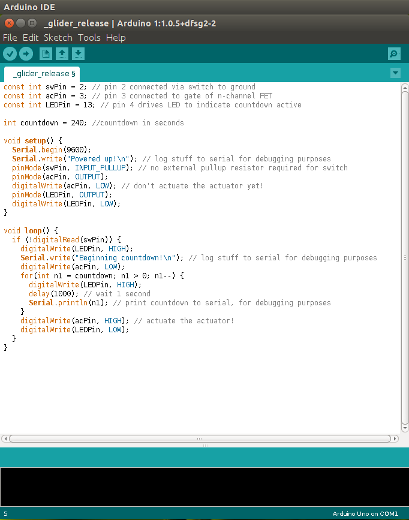
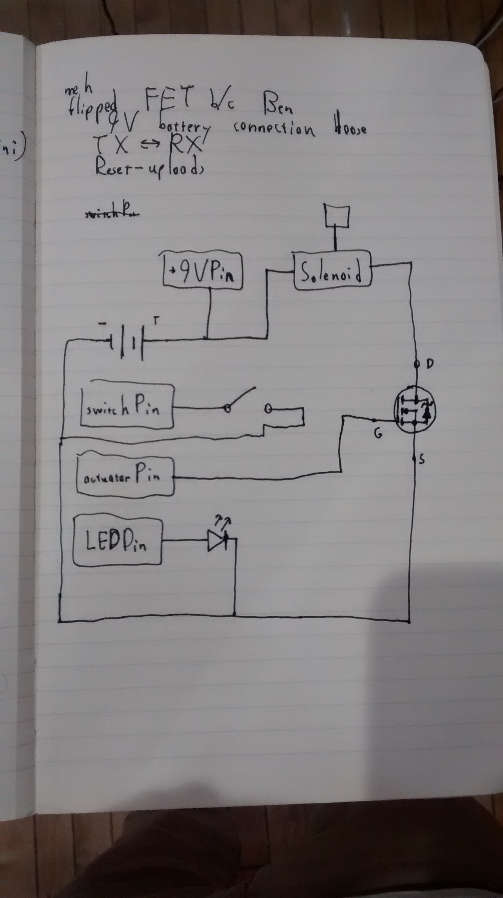
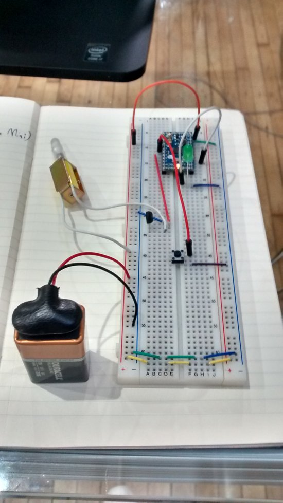
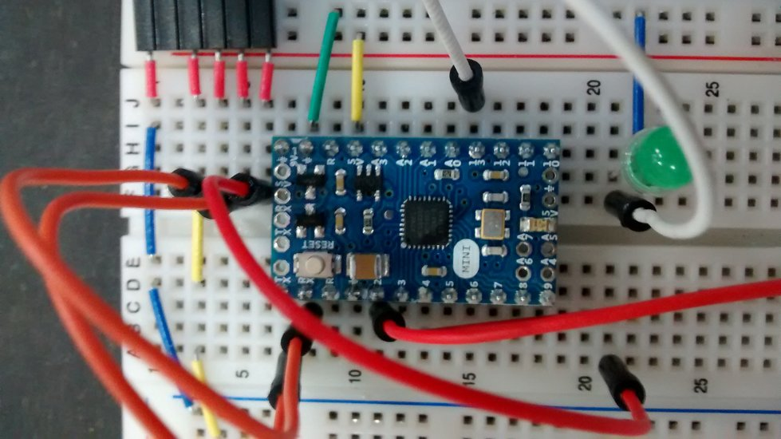
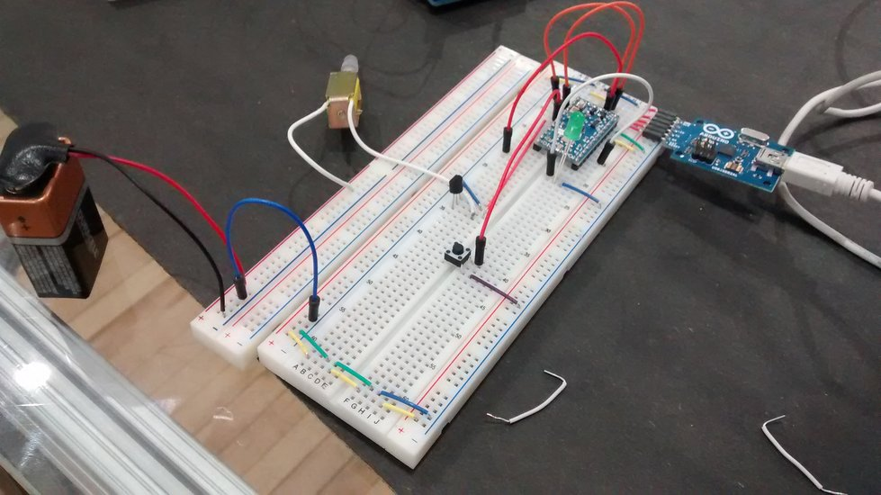
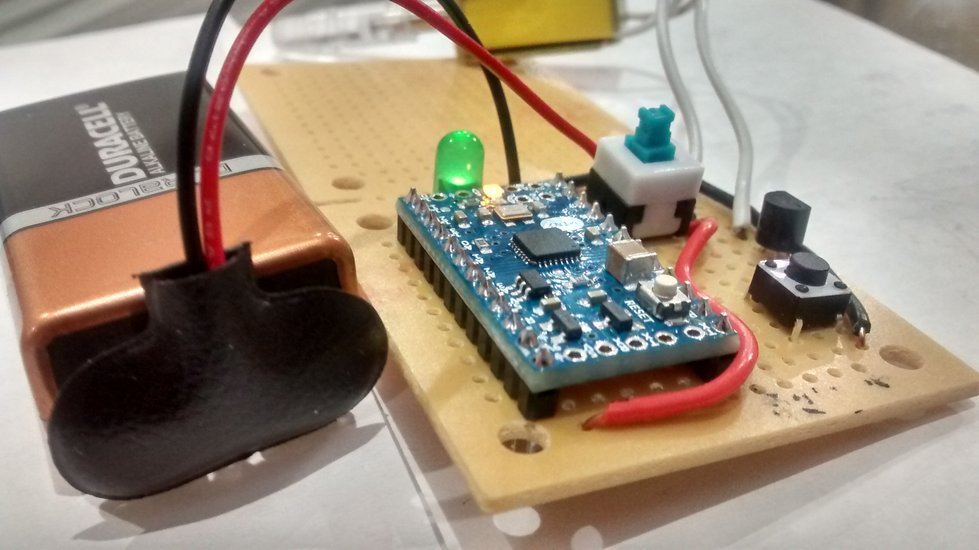
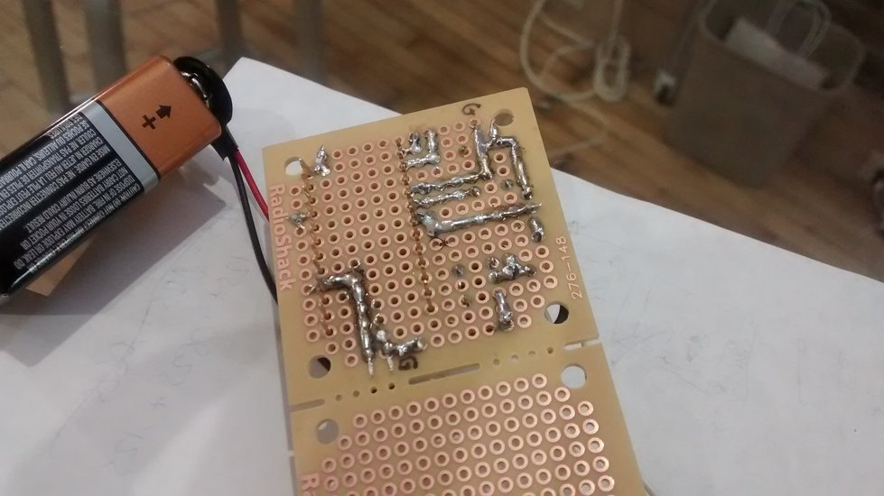
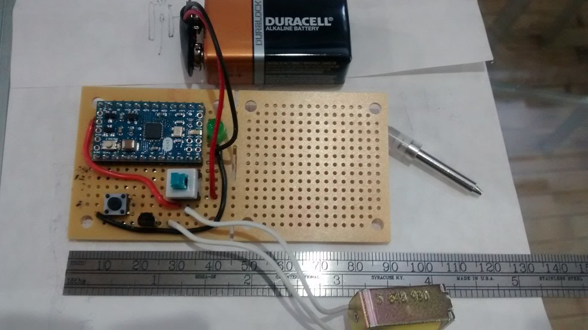

At late September, I received an email from [Kite & Rocket](http://kiteandrocket.com/) telling me that the company was working on a [balloon launch](http://devchuk.github.io/portfolio/miscellaneous/balloon.html) for a [mini-maker faire](http://makerfaire.com/) in Providence, Rhode Island. They needed my help to set up the launch and gather materials to build another Balloon Phone.

When I came in, it turns out that they changed their minds about the balloon launch. Instead of having balloons lift up a camera, they wanted to have balloons lift up a <b>glider containing the camera</b>. The idea was that after the balloons reach a certain altitude, a releasing mechanism would let go of the glider and have it gracefully fly away&mdash;all while transmitting a livestream to a large screen down on the ground. I had no idea how to build it, so most of the things I did here were self-taught as I went. Let's look at the materials & tools I used. 

Programming:
>		an Arduino IDE
>		decent knowledge in the Arduino programming language

Electrical:
>		electrical prototyping tools (breadboards, jumper cables, common sense, etc.)
>		Arduino Mini with ATMega328
>		a button press switch
>		VN2222 n-channel FET
>		USB2Serial MicroUSB Arduino Mini connector
>		a 9V battery
>		a solenoid
>		a protoboard
>		soldering tools, skills, and a steady hand

Mechanical:
>		cable ties
>		ribbons
>		a helium tan
>		lots and lots of foil balloons
>		a Verizon Wireless Prepaid Motorola Moto G No-Contract Cell Phone
>		a 500 MB data plan with unlimited texting and stuff I still don't remember
>		a 3D printer & CAD software
>		some sort of apparatus hook onto the releasing mechanism
>		a glider
>		decent knowledge on flying mechanics

The releasing mechanism was first built. The way it works it pretty simple. You turn it on. You press the countdown button. And then you release the balloon. After a specified amount of seconds a green LED would light up and the releasing mechanism would release the glider. To do the countdown, an .ino program was created.

 
<small><i>The program</i></small>
  

After that, I created the circuit for the releasing mechanism. 

		 
<small><i>Prototyping</i></small>

To be honest, I didn't plan out the circuit before I finished building the circuit. I just created each part of the circuit(the LED, the button, and the mechanical releaser) and connected them all together. I guess now that I think about it, most of the things I built which I had no idea how to engineer were all made without planning. It's a lot easier to create something and continue to modify it to solve any issues you notice instead of trying to predict all issues from the very beginning. Of course, planning should be done for in situations where you're working with expensive parts, complicated systems, or parts that are hard to undo modifications.

 
		 
<small><i>Uploading</i></small>

Unlike other Arduinos, the Arduino mini is so tiny that it does not have a port to direct connect to the computer. Instead, a USB to Serial MicroUSB Arduino Mini connector is required, and the connector communicates to the Arduino through its own pins. This meant that I had to make sure that I could attach the connector to the circuit if I ever had to upload code to the Arduino. In the test run below, the releasing mechanism is set at a two second countdown for the sake of faster testing.

<iframe width="979" height="551" src="//www.youtube.com/embed/kR9CeKd3Egc?rel=0" frameborder="0" allowfullscreen></iframe>

After that, I used a soldering iron and moved the parts from the breadboard onto a protoboard. For those who don't know, solderings is when one melts an alloy with a 600&deg; F tool called a soldering iron in order to join metals together when the alloy cools down. The protoboard circuit is the same as the breadboard circuit other than the use of the blue on-and-off button press switch.

		
		 
<small><i>The final build. Only 45 cm long!</i></small>

Once the electrical and programming components were done, I started the mechanical portion. The idea was to have the camera attached to the very front of the plane, thus giving a real point of view of the airplane. It turns out that the company's sponsor for the event, Hasbro, rejected the idea of a glider launch. Hasbro wasn't willing to risk the chance of the glider crashing into a person. Thus, we ended up having a normal balloon camera like [last time](http://devchuk.github.io/portfolio/miscellaneous/balloon.html).