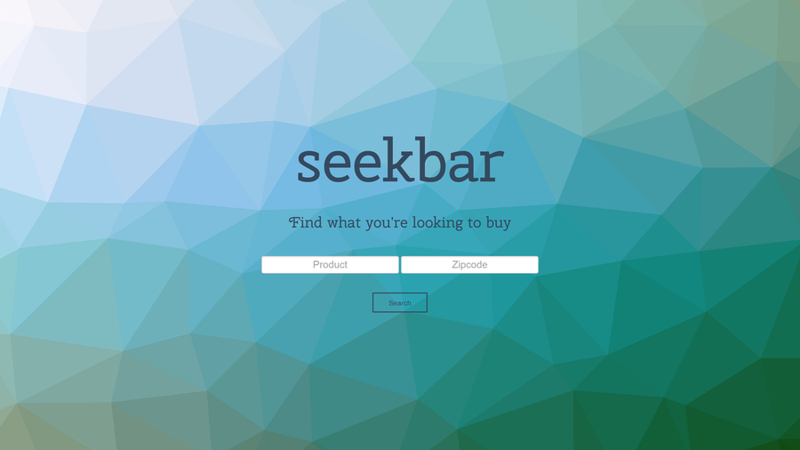
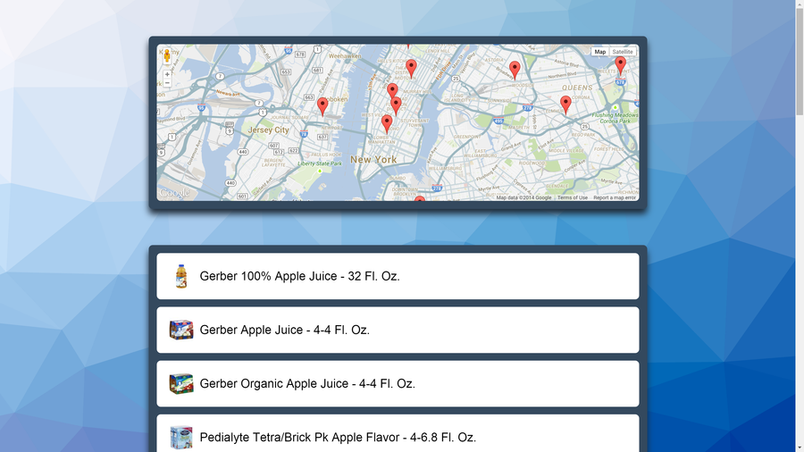

 
<small><i>The home page.</i></small>

A couple weeks ago a friend and I decided to make sushi and had to head out to buy the ingredients. We were able to buy all the ingredients we needed except for one ingredient: seaweed. It turns out that the first supermarket we visited didn't sell seaweed and the store after that, Trader Joe's, ran out of stock for seaweed. It took us 4 supermarkets until we were able to find seaweed!

To solve problems like this, [Jack](http://jackcook.nyc/) and I created a hack during [HackNY](http://hackny.org/a/spring2014hackathon/). It's called seekbar, a search engine for real life. It's for when you know what you want to buy but don't know the closest place to get it. Just type in what you're looking for and your zip code and seekbar will do the rest for you. It covers a larger assortment of objects—from apples to paper clips to shampoo to iPads.

 
<small><i>The search page</i></small>

  
Check out our source code [here](https://github.com/jackcook/seekbar/tree/gh-pages).